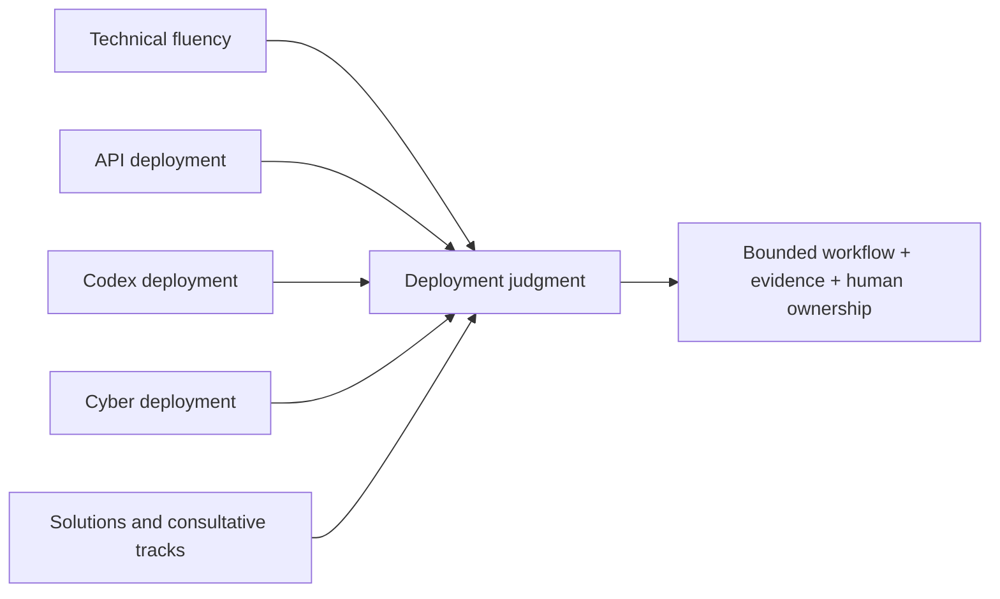

# Course-based study notes

This directory is the canonical, course-first view of the PartnerU notes. Each course has a readable `README.md` followed by its detailed module notes. The older subject-area directories are no longer the primary navigation path; they remain useful for lab scripts and generated artifacts.

The four core practitioner tracks converge on the same interview habit: fit the workflow, make the boundaries explicit, and explain what evidence supports the next decision.

## Courses

1. [OpenAI Technical Practitioner](openai-technical-practitioner/README.md)
2. [API Deployment Practitioner](api-deployment-practitioner/README.md)
3. [Codex Deployment Practitioner](codex-deployment-practitioner/README.md)
4. [OpenAI Cyber Deployment Practitioner](cyber-deployment-practitioner/README.md)
5. [ChatGPT Solutions Practitioner](chatgpt-solutions-practitioner/README.md)
6. [ChatGPT Deployment Practitioner](chatgpt-deployment-practitioner/README.md)
7. [Codex Solutions Practitioner](codex-solutions-practitioner/README.md)
8. [OpenAI Cyber Solutions Practitioner](cyber-solutions-practitioner/README.md)
9. [Consultative Solutions Practitioner](consultative-solutions-practitioner/README.md)

## Fact-checking convention

- **Durable guidance** is kept as a study principle: start from a workflow, bound scope, test with evidence, and keep consequential decisions human-owned.
- **Volatile product facts** carry a date or a “verify before build” warning. Model IDs, endpoints, features, pricing, limits, retention controls, access programs, and workspace entitlements can change.
- **Course-specific language** is labeled as PartnerU guidance. It is not a public promise about eligibility, pricing, access, refusal behavior, or deployment terms.
- The API course guide links to current official OpenAI documentation for Responses, data controls, request IDs, model guidance, and structured outputs.
