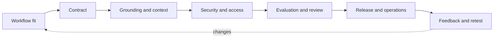

# API Deployment Practitioner

## What this course is really teaching

An API demo is only the beginning. A deployable solution needs a clear contract, safe data and access boundaries, a measured evaluation, observable operations, and a human-owned release decision. The course modules are different views of the same lifecycle: **fit the workflow, define the contract, ground the answer, secure the path, evaluate it, and operate it.**

## In plain English

The question is not “Can the API produce an answer?” It is “Can a real team use this safely and repeatedly?” These notes walk from the first architecture decision through testing, security review, release, monitoring, and support.

## A practical reading order

1. Start with architecture and model/capability fit.
2. Define the request, response, state, error, tool, and retry contracts.
3. Decide whether approved retrieval or other context is needed.
4. Add structured outputs, evals, moderation/guardrails, and human-review paths.
5. Review data handling, secrets, permissions, logging, rollout, observability, rollback, and support.
6. Use the Northstar application note to practice a release recommendation.

## Interview-ready answer

> “I would not call an API production-ready because the happy path works. I would specify the workflow and contract, test normal and failure cases, verify identity and permission-aware retrieval, define what is logged and retained, instrument latency/errors/cost/quotas, and name release, support, rollback, and escalation owners. The recommendation should state what the evidence proves and what remains unproven.”

## Current official-docs checks (2026-09-16)

- The Responses API supports tools, structured output, and state-related options. Structured Outputs use `json_schema`; older JSON mode guarantees valid JSON but not your application schema. See the [Responses API reference](https://developers.openai.com/api/reference/cli/resources/beta/subresources/responses).
- API data is not used for training by default, but retention depends on abuse-monitoring and endpoint/application-state behavior. Zero Data Retention and Modified Abuse Monitoring are eligibility-controlled options; do not promise them from a generic architecture note. See [Your data](https://developers.openai.com/api/docs/guides/your-data).
- Request IDs and rate-limit headers are useful production signals. Do not log raw customer content or secrets merely to improve debugging. See the [API overview](https://developers.openai.com/api/reference/overview).
- Model names, capabilities, pricing, limits, and availability are volatile. Record the exact model ID and the date checked.

## Module notes

- [API solution architecture](notes/api-solution-architecture-notes.md)
- [Model and capability selection](notes/model-and-capability-selection-notes.md)
- [API contracts and core interfaces](notes/api-contracts-and-core-interfaces-notes.md)
- [Context, data, and retrieval](notes/context-data-retrieval-grounded-api-notes.md)
- [Prompt design, evals, moderation, guardrails, and human review](notes/prompt-design-evals-moderation-guardrails-human-review-notes.md)
- [API security, data handling, and access controls](notes/api-security-data-handling-access-controls-notes.md)
- [Realtime, voice, and multimodal experiences](notes/realtime-voice-multimodal-api-experiences-notes.md)
- [Deep research, images, distillation, and specialized patterns](notes/deep-research-images-distillation-specialized-api-pattern-fit-notes.md)
- [DevOps, observability, and production readiness](notes/devops-observability-production-readiness-notes.md)
- [Deployment practice application](notes/api-deployment-practice-application-notes.md)

## Status

The module notes record the completed PartnerU learning activities. Re-check live product facts before using them in a design or interview case study.
