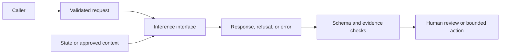

# API Contracts and Core Interfaces — concise notes

Course status snapshot: PartnerU recorded this module as complete. Re-check the live dashboard if completion status matters.

## Core idea

Choose the interface from the workflow requirement, then make request shape, response shape, state, errors, and verification explicit. A contract is a build/test/handoff tool—not a final production design or a substitute for current official documentation.

## In plain English

Think of the contract as the agreement between your application and the API. It should tell the next engineer what goes in, what can come back, what happens when something fails, and who must review an uncertain result.

## Interface decision guide

- **Responses API:** often a strong starting point for new projects when the workflow needs structured output, tools, multimodal/agentic behavior, or controlled application-level inference. Confirm the exact supported capabilities, SDK examples, streaming/async behavior, and limitations before implementation.
- **Chat Completions API:** may still be appropriate for existing systems or compatibility constraints. Do not copy it into a new workflow without checking current guidance and migration impact.
- **Conversations API:** persistent conversation-state infrastructure used with Responses, not a separate inference interface. Use only when continuity across sessions, devices, jobs, or follow-up turns is required.

Choose inference interface first, then a separate state approach: stateless, application-managed/chained context, or persistent Conversations state.

## Design implications to expose

- **State/context:** stateless requests include all required context; stateful designs document what is retained, where it lives, owner, retention/privacy policy, and missing/stale/mismatched-state behavior.
- **Tools/actions:** define purpose, input, output, execution boundary, permissions, failure behavior, and approval needs. Separate read-only lookup from write/action behavior.
- **Streaming/async:** decide whether the client needs progressive output, a complete response, or a delayed result/status reference. Define completion, progress, timeout, failure, retry, and client-next-step behavior.
- **Structured outputs:** use predictable fields for dashboards, routing, automation, tools, review, analytics, or downstream processing. Define required/optional fields, types, allowed values, meanings, and invalid-output behavior. JSON validity alone does not guarantee schema adherence; a model-written confidence note is not a calibrated confidence score.
- **Retries/idempotency:** if a request may run twice, assess duplicate records, messages, work, or customer-visible actions. Add a request ID/deduplication assumption where needed.

## Core Interface and API Contract Plan

1. Workflow requirement and user/system actor
2. Recommended inference interface and rationale
3. State approach and context assumptions
4. Tool, streaming, async, retry, and idempotency assumptions
5. Structured-output mechanism and schema
6. Request contract: purpose, method/route, headers, authentication, caller, required/optional body fields, validation, state/context references, excluded fields
7. Response contract: success condition/status, body, required/optional fields, schema, source/evidence/review fields, next-step behavior
8. Error states and status codes/categories
9. Verification tests and evidence
10. Open implementation/product/governance questions and next validation step

## Example request/response shape

**Request:** `account_id` (required), `issue_text` (required), `approved_context_ids` (required when grounding is needed), optional `user_question`/focus. Exclude credentials, secrets, payment details, and unapproved notes.

**Response:** `issue_summary`, `urgency` (`low|medium|high`), `recommended_next_action`, `source_ids` (when grounded), `confidence_note` (explanatory only), `needs_human_review`, and `review_reason` when review is required.

## Error contract

Cover missing/invalid fields, invalid authentication, authenticated-but-unauthorized access, unsupported input/workflow, missing or unavailable context/source, timeout/async/dependency failure, tool failure, structured-output failure, retry condition, state/conversation mismatch, and approval-required conditions. For each, define trigger, status/category, user-safe message, and client/reviewer next step. Never leak sensitive internal details.

## Verification plan

- **Success:** valid request returns all required fields and valid structure.
- **Input/auth/access:** missing field, invalid authentication, unauthorized account/data.
- **Context/source:** missing or unavailable approved context; no invented source-backed claims.
- **Output:** schema adherence, missing/invalid fields, refusal/incomplete/non-schema paths, review-trigger behavior.
- **State:** continuity, missing/expired/mismatched conversation reference.
- **Streaming/async:** partial-output/final-completion semantics, progress, timeout, failure, retry.
- **Retry/idempotency:** repeated request after timeout does not duplicate records or actions.

For every test, record request, expected response, actual response, pass/fail/needs-review, what it proves, what it does not prove, and the remaining owner/open question. A passing happy path does not prove permissions, resilience, scale, security posture, monitoring, governance, or production readiness.

## Handoff rules

- Keep the plan concise and use specific field names and examples (one success plus at least one failure).
- Mark assumptions clearly and separate durable design logic from volatile product facts.
- Do not hardcode unvalidated model names, SDK versions, endpoint behavior, pricing, limits, or capability combinations.
- Validate current interface names, capabilities, schemas, state behavior, streaming/async guidance, and status-code guidance in approved current documentation before implementation.

## One-line takeaway

Make the API interaction specific enough that another team can build it, test it, review it, and see exactly what remains unresolved.

## Fact-check (2026-09-16)

The current Responses documentation describes tools, state-related options, Structured Outputs, and JSON mode. `json_schema` is the schema-enforced option; JSON mode only asks for valid JSON, so the application still needs validation. Conversations is a separate state resource used when durable conversation continuity is actually required. Check the live reference before coding because endpoint and SDK behavior can change.

See the [Responses API reference](https://developers.openai.com/api/reference/cli/resources/beta/subresources/responses), [create-a-response reference](https://developers.openai.com/api/reference/cli/resources/responses/methods/create), and [Conversations API reference](https://developers.openai.com/api/reference/cli/resources/beta/subresources/conversations).
