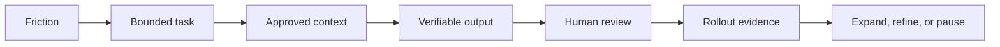

# Codex Deployment Practitioner

## What this course is really teaching

Codex adoption is an operating-model problem, not simply a tool rollout. Start with a real engineering bottleneck, choose the surface and collaboration pattern that fit the work, put review and recovery controls around delegation, and expand only when both delivery evidence and safeguard evidence are strong.

## In plain English

Treat Codex like a capable teammate whose work still needs a clear brief, the right context, tests, and an owner who can accept or reject the result. The safest rollout starts small and earns more autonomy through evidence.

## The mental model

**Friction → bounded task → approved context → verifiable output → human review → rollout evidence.**

Autocomplete, pair programming, review support, and delegated work are different collaboration patterns. A task is ready for delegation only when the goal and scope are clear, context is approved, the result can be verified, and a human can accept, revise, or reject it.

## Interview-ready answer

> “I would begin with one workflow and one team, define the context and allowed actions, require tests and review evidence, and record what happened. I would measure safe delivery and reviewer burden alongside adoption. Only after the controls work repeatedly would I expand surfaces, repositories, automation, or cloud execution.”

## Product-fact caution

The course patterns around surfaces, worktrees, `AGENTS.md`, rules, cloud tasks, Spark, and enterprise governance are operating guidance—not a promise that every account has every surface or feature. Check the current Codex documentation, model page, workspace policy, and account entitlements before making a deployment commitment. Official Codex use cases currently include code review/security workflows and long-running or reusable engineering tasks; the [Codex use-cases page](https://developers.openai.com/codex/use-cases) is the right place to re-check current positioning.

## Module notes

- [Deployment operating model and workflow patterns](notes/codex-deployment-practitioner-notes.md)
- [Enterprise rollout design takeaways](notes/openai-codex-deployment-practitioner-notes.md)

## Lab artifact

- [Rollout lab script](../../codex/scripts/build_codex_rollout_lab.py)
- [Rollout one-pager](../../codex/output/Codex_Enterprise_Rollout_Design.pdf)

## Status note

The module notes contain a dated PartnerU status snapshot. Treat “awaiting review” or “final exam locked” as historical observations unless you verify the dashboard again.
