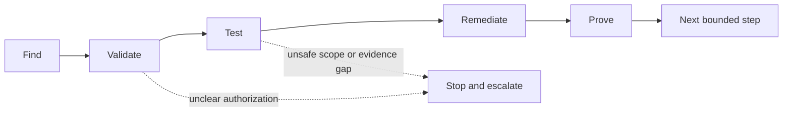

# OpenAI Cyber Deployment Practitioner

## What this course is really teaching

Responsible cyber deployment begins with authorization and ends with a reviewable customer decision. The course’s recurring loop is **find → validate → test → remediate → prove**. The goal is not to maximize findings; it is to move a bounded defensive workflow from uncertain signal to evidence-backed action while keeping security and engineering decisions human-owned.

## In plain English

Start with one asset you are allowed to inspect. Let the system help gather and explain evidence, but keep severity, remediation, and acceptance decisions with the customer’s security and engineering reviewers.

## The mental model

Before running anything, make six things explicit: defensive purpose, owned or authorized scope, approved environment, evidence ceiling, named reviewer, and stop/escalation conditions. Keep source facts, supported inference, runtime proof, remediation status, and proof gaps separate.

## Interview-ready answer

> “I would start with one authorized repository or pull request, define what the tool may inspect and change, and agree on the evidence needed by AppSec and engineering. I would measure validity, noise, reviewer effort, handoff quality, and time to a reviewed fix. I would not claim a vulnerability is validated, a repository is secure, or a patch is accepted until the customer’s reviewers and tests establish that.”

## Product-fact caution

The official models catalog now describes OpenAI Daybreak as advanced cyber models for defenders and lists GPT-5.6 Cyber, Daybreak Red, and Daybreak Blue. That listing does not guarantee a user’s eligibility, access, pricing, data retention, reduced refusals, or deployment terms; confirm those through the approved OpenAI process. Trusted Access remains approval-process/course terminology. The durable recommendation is workflow-first, authorization-first, bounded, and human-reviewed. See the [official models catalog](https://developers.openai.com/api/docs/models).

## Module notes

- [Cyber deployment and exam notes](notes/openai-cyber-practitioner-notes.md)

## Lab artifact

- [Northstar lab script](../../cyber/scripts/build_northstar_lab.py)
- [Northstar security recommendation](../../cyber/output/Northstar_Financial_Customer_Security_Recommendation.pdf)

## Status correction

The program was observed as complete at 100% after the lab review and 20/20 final exam. The feedback page marked the program complete; the survey-submission state was not independently verified, so the notes no longer claim that the survey was submitted.
