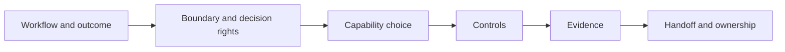

# OpenAI Technical Practitioner

## What this course is really teaching

Technical fluency is less about memorizing product names and more about making a defensible design choice. Start with the customer’s workflow, outcome, constraints, and evidence. Then choose the smallest OpenAI capability that fits and make the risks, owners, and next validation step visible.

## A simple way to remember it

**Workflow → boundary → capability → controls → evidence → handoff.**

Ask what the user is trying to accomplish, what information and systems are involved, what the model may and may not do, where a human must review, and what would prove the design is ready. This sequence works in architecture reviews, customer discovery, and management interviews.

## Interview-ready answer

> “I would first bound the workflow and its decision rights. I would then select the simplest capability—direct generation, structured output, retrieval, tools, or a multi-step flow—that meets the quality and latency needs. Before recommending launch, I would verify permissions, data handling, evaluation, observability, rollback, and named ownership.”

## What is durable vs. what changes

The workflow-first method is durable. Model IDs, API features, limits, pricing, availability, retention options, and access programs change; check current official documentation before implementation or a customer promise.

## Notes

- [OpenAI Technical Practitioner notes](notes/openai-technical-practitioner-notes.md)

## Status

PartnerU record captured the program as complete. This file is a study guide, not a live completion tracker.
